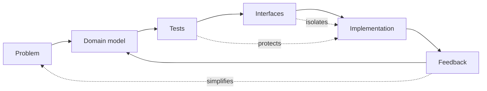

<div align="center">


<p>
  <a href="https://github.com/alebrait?tab=repositories"></a>
  <a href="https://github.com/alebrait"></a>
  
</p>

<h3>Python / Django - Go - React / TypeScript - PostgreSQL - Docker - AI tooling</h3>

<p>
  I build software that is meant to survive contact with real users, future changes,
  and the next developer who has to understand it.
</p>

</div>

---

## What I Care About

<table>
  <tr>
    <td width="50%" valign="top">
      <h3>Engineering taste</h3>
      <ul>
        <li>Readable systems over clever fragments</li>
        <li>Tests that describe behavior</li>
        <li>Explicit boundaries and dependencies</li>
        <li>Small abstractions that earn their place</li>
      </ul>
    </td>
    <td width="50%" valign="top">
      <h3>Current direction</h3>
      <ul>
        <li>Production-grade Django and React applications</li>
        <li>Focused Go services and backend infrastructure</li>
        <li>AI-assisted development workflows</li>
        <li>Design systems and agent skills for better frontends</li>
      </ul>
    </td>
  </tr>
</table>

```text
Readable > clever
Tests describe behavior
Dependencies point inward
Abstractions must earn their place
Code should still make sense years later
```

## Public Work

<table>
  <tr>
    <td width="50%" valign="top">
      <h3><a href="https://github.com/alebrait/impeccable">Impeccable</a></h3>
      <p>Design guidance for AI coding agents: skills, commands, browser iteration, and detector rules for stronger frontend output.</p>
      <p><code>AI tooling</code> <code>frontend design</code> <code>agent skills</code></p>
    </td>
    <td width="50%" valign="top">
      <h3><a href="https://github.com/alebrait/no-cost-ai">No Cost AI</a></h3>
      <p>A living index of free and low-friction AI tools for builders, researchers, and curious developers.</p>
      <p><code>AI index</code> <code>developer resources</code> <code>curation</code></p>
    </td>
  </tr>
  <tr>
    <td width="50%" valign="top">
      <h3><a href="https://github.com/alebrait/awesome-ai-dev-prompts">Awesome AI Dev Prompts</a></h3>
      <p>A prompt library for coding agents, architecture work, debugging, backend APIs, frontend systems, and AI applications.</p>
      <p><code>prompt engineering</code> <code>architecture</code> <code>AI development</code></p>
    </td>
    <td width="50%" valign="top">
      <h3><a href="https://github.com/alebrait/taste-skill">Taste Skill</a></h3>
      <p>Portable agent skills for better layout, typography, motion, spacing, and visual taste in AI-built interfaces.</p>
      <p><code>design systems</code> <code>frontend</code> <code>agent workflows</code></p>
    </td>
  </tr>
  <tr>
    <td width="50%" valign="top">
      <h3><a href="https://github.com/alebrait/skills">Skills</a></h3>
      <p>Personal Codex skill experiments and reusable instructions for making AI coding work more consistent.</p>
      <p><code>Codex</code> <code>skills</code> <code>automation</code></p>
    </td>
    <td width="50%" valign="top">
      <h3><a href="https://github.com/alebrait/go-patterns">Go Patterns</a></h3>
      <p>Go pattern notes and examples while sharpening small-service design, concurrency, and idiomatic backend structure.</p>
      <p><code>Go</code> <code>patterns</code> <code>backend</code></p>
    </td>
  </tr>
</table>

<details>
  <summary><strong>More repositories worth browsing</strong></summary>
  <br>

  <table>
    <tr>
      <th align="left">Repository</th>
      <th align="left">Area</th>
    </tr>
    <tr>
      <td><a href="https://github.com/alebrait/collective-ai-tools">collective-ai-tools</a></td>
      <td>AI tooling and discovery</td>
    </tr>
    <tr>
      <td><a href="https://github.com/alebrait/learn-go-with-tests">learn-go-with-tests</a></td>
      <td>Go practice through tests</td>
    </tr>
    <tr>
      <td><a href="https://github.com/alebrait/project-layout">project-layout</a></td>
      <td>Application structure experiments</td>
    </tr>
    <tr>
      <td><a href="https://github.com/alebrait/django-registration-templates">django-registration-templates</a></td>
      <td>Django authentication templates</td>
    </tr>
    <tr>
      <td><a href="https://github.com/alebrait/developer-portfolios">developer-portfolios</a></td>
      <td>Portfolio/reference collection</td>
    </tr>
    <tr>
      <td><a href="https://github.com/alebrait/autoresearch">autoresearch</a></td>
      <td>Research automation experiments</td>
    </tr>
  </table>

</details>

## System Shape

GitHub profile READMEs do not run custom JavaScript, but they do render Mermaid diagrams. This is the kind of engineering loop I try to keep visible in my work:



## Toolbox

<table>
  <tr>
    <td valign="top" width="25%">
      <strong>Backend</strong><br>
      Python<br>
      Django<br>
      Go<br>
      REST APIs
    </td>
    <td valign="top" width="25%">
      <strong>Frontend</strong><br>
      React<br>
      TypeScript<br>
      Next.js<br>
      HTML/CSS
    </td>
    <td valign="top" width="25%">
      <strong>Data and infra</strong><br>
      PostgreSQL<br>
      Docker<br>
      Linux<br>
      GitHub
    </td>
    <td valign="top" width="25%">
      <strong>Practices</strong><br>
      TDD<br>
      Clean Architecture<br>
      Dependency inversion<br>
      Code review
    </td>
  </tr>
</table>

## Stats

<div align="center">


</div>

## Private And In Progress

Some of my more application-heavy work is private or still being shaped before it is worth presenting publicly, including ecommerce architecture, authorization services, and reflective/productivity applications. I keep this profile linked to public repositories that actually exist.

---

<div align="center">

<strong>Build - test - simplify - maintain.</strong>

</div>